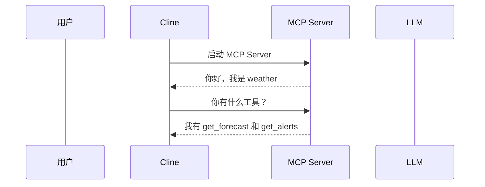
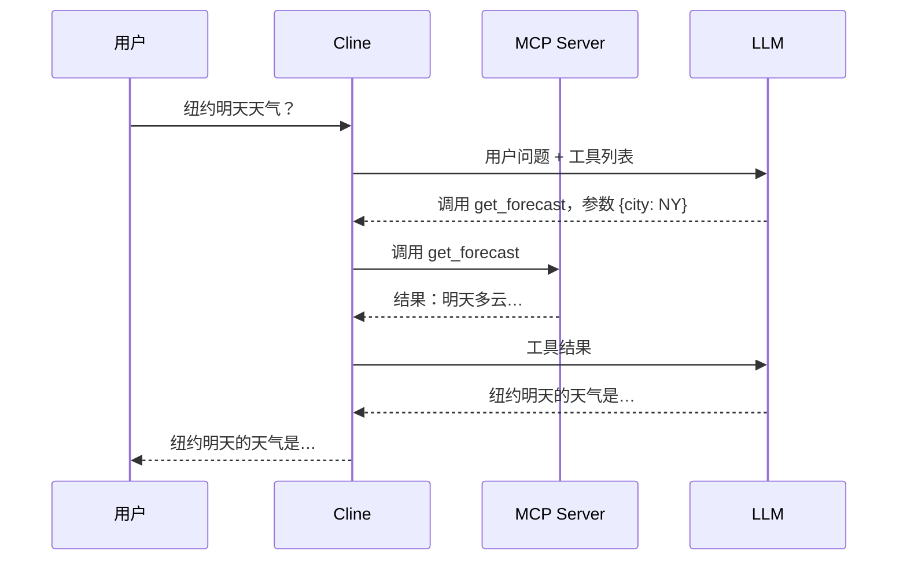

# Cline MCP 提示词抓包工具

抓取 Cline 与LLM交互全过程的提示词，包括系统提示词、用户消息、MCP工具定义、工具调用和LLM响应。

## 项目目的

本项目的目标是研究 AI Agent 与 MCP 的实际运作机制——LLM 如何接收工具定义、如何决策调用工具、工具结果如何影响最终输出。

由于 Agent 与 LLM、MCP Server 之间的通信对外完全不可见，本工具选取 Cline 作为研究案例，通过在通信链路上插入透明代理，在不修改 Cline 源码的前提下，完整捕获每一次交互内容。

## 背景：什么是 MCP？

**MCP（Model Context Protocol）** 是 Anthropic 提出的开放协议，用于标准化 AI 助手与外部工具/数据源之间的通信方式。

MCP 生态中有两个核心角色：

| 角色 | 说明 | 本项目中的对应 |
|------|------|----------------|
| **MCP Host** | 运行LLM、管理对话的宿主应用，决定加载哪些 MCP Server，并把工具结果喂回给LLM | Cline（VSCode 插件） |
| **MCP Server** | 实现了 MCP 协议的独立程序，负责把某种具体能力（网页抓取、文件读写、数据库查询等）暴露给LLM，社区已有大量开箱即用的实现 | `weather`（本仓库示例） |

在 Cline 这类 AI 编程助手中，MCP 的作用是让LLM能够调用外部能力，例如读取文件、执行搜索、访问数据库等。整个流程分为两个阶段：

**阶段一：初始化（Cline 启动 / 加载 MCP 配置时）**



**阶段二：对话（用户提问后）**



本工具在两段通信链路上分别插入代理：一段是 Cline 与 LLM 之间的 HTTP 通信，另一段是 Cline 与 MCP Server 之间的 stdio 通信。两段合在一起，覆盖了 AI Agent 运行的完整链路。

## 架构

本工具在两条通信链路上分别插入代理进行拦截：

**链路一：Cline ↔ LLM（HTTP 代理）**

```
+------+     +----------+     +--------------+     +-----+
| User |<--->|  Cline   |<--->|  HTTP Proxy  |<--->| LLM |
| 用户 |     | (VSCode) |     |  (port 8001) |     |     |
+------+     +----------+     +------+-------+     +-----+
                                      |
                                 保存提示词
                                      |
                              +-------v------+
                              |    Web UI    |
                              |  查看提示词  |
                              +--------------+
```

**链路二：Cline ↔ MCP Server（stdio 代理）**

```
+----------+     +--------------+     +--------------+
|  Cline   |<--->| stdio Proxy  |<--->|  MCP Server  |
| (VSCode) |     |  (包装器)    |     |  (实际服务)  |
+----------+     +------+-------+     +--------------+
                         |
                    保存 MCP 通信
                         |
                 +-------v------+
                 |  JSONL logs  |
                 |  MCP 日志    |
                 +--------------+
```

## 快速开始

### 1. 安装依赖

```bash
pip install -r requirements.txt
```

### 2. 启动 LLM API 代理

```bash
python proxy_server.py --target <你的LLM API地址> --port 8001
```

`--target` 填你实际使用的 LLM API Base URL，例如：

| 提供商 | `--target` 值 |
|--------|--------------|
| 阿里千问 | `https://dashscope.aliyuncs.com/compatible-mode/v1` |
| OpenAI | `https://api.openai.com/v1` |
| 本地 Ollama | `http://localhost:11434/v1` |

参数说明：
- `--target` / `-t`：真实 LLM API 地址（必填）
- `--port` / `-p`：代理监听端口（默认 `8001`）
- `--host`：监听地址（默认 `127.0.0.1`）

### 3. 配置 Cline

在 Cline 设置中将 API Base URL 指向代理：

1. 打开 VSCode，点击侧边栏 Cline 图标
2. 点击右上角齿轮（Settings）
3. API Provider 选择 **OpenAI Compatible**
4. Base URL 填入 `http://localhost:8001`
5. API Key 和 Model 保持不变

### 4. 配置 MCP Server

本仓库附带示例 MCP Server（`weather/`），用于捕获 Cline 与 MCP 工具之间的完整 stdio 通信。

**打开 Cline 的 MCP 配置文件：**

- **方式一（推荐）**：Cline 面板 → 顶部 MCP Servers 图标 → Configure → Configure MCP Servers
- **方式二（直接编辑）**：
  - Windows：`%APPDATA%\Code\User\globalStorage\saoudrizwan.claude-dev\settings\cline_mcp_settings.json`
  - macOS：`~/Library/Application Support/Code/User/globalStorage/saoudrizwan.claude-dev/settings/cline_mcp_settings.json`

**先添加不带代理的配置，验证 weather server 能正常连接：**

```json
{
  "mcpServers": {
    "weather": {
      "command": "uv",
      "args": ["--directory", "/path/to/mcp抓包/weather", "run", "weather.py"]
    }
  }
}
```

**确认连接正常后，改为通过 stdio 代理启动（开启拦截）：**

```json
{
  "mcpServers": {
    "weather": {
      "command": "python",
      "args": [
        "/path/to/mcp抓包/mcp_stdio_proxy.py",
        "--name", "weather",
        "--log-dir", "/path/to/mcp抓包/mcp_logs",
        "--",
        "uv", "--directory", "/path/to/mcp抓包/weather", "run", "weather.py"
      ]
    }
  }
}
```

将 `/path/to/mcp抓包/` 替换为本项目的实际路径。MCP 通信日志保存在 `mcp_logs/` 目录下，格式为 JSONL。

### 5. 查看抓取结果

打开浏览器访问：`http://localhost:8001/ui`

- **LLM 通信** 标签：查看 Cline 与 LLM 之间的完整提示词和响应
- **MCP 通信** 标签：查看 Cline 与 MCP Server 之间的 JSON-RPC 消息

## 抓取到的内容

### LLM API 代理抓取
- **System Prompt**：Cline 的完整系统提示词（含 MCP 工具定义的 XML 描述）
- **User Messages**：用户消息和上下文
- **Assistant Response**：LLM 的完整响应（含 `<use_mcp_tool>` 工具调用 XML）
- **Tool Results**：工具返回的结果
- **Token 用量**：每次请求的 token 消耗

### MCP stdio 代理抓取
- **JSON-RPC 请求/响应**：完整的 MCP 协议通信
- **工具列表获取**：`tools/list` 请求
- **工具调用**：`tools/call` 请求和响应
- **资源访问**：`resources/read` 等请求

## API 端点

| 端点 | 说明 |
|------|------|
| `GET /api/captures` | 捕获记录列表（摘要） |
| `GET /api/captures/:id` | 单条记录完整内容 |
| `GET /api/captures/:id/messages` | 格式化消息列表 |
| `GET /api/captures/:id/tools` | 工具定义列表 |
| `GET /api/stats` | 统计信息 |
| `GET /api/export` | 导出全部数据 |
| `POST /api/clear` | 清空记录 |

## 文件结构

```
mcp抓包/
├── proxy_server.py      # LLM API 反向代理服务器
├── mcp_stdio_proxy.py   # MCP stdio 通信代理包装器
├── requirements.txt     # Python 依赖
├── web/
│   └── index.html       # Web UI
├── weather/             # 示例 MCP Server（天气查询）
│   ├── weather.py
│   └── pyproject.toml
├── captures/            # LLM API 捕获数据（自动创建）
└── mcp_logs/            # MCP 通信日志（自动创建）
```
